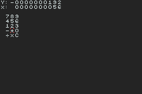

# GBA RPN Calculator


An RPN calculator for the GBA written in ARM assembly. It displays the X and Y registers and can add, subtract, multiply, and divide.

**Note: unless a proper header is added, these programs will not work on real hardware (nor some emulators).**
I do not include the bitmap of the Nintendo logo in the header in order to avoid copyright infringement.
If you want to run these programs on an emulator, I'd recommend [No$gba](https://problemkaputt.de/gba.htm) or [mGBA](https://mgba.io/).

---

## Build Instructions

Assemble with the [Goldroad 1.7](https://www.gbadev.org/tools.php?showinfo=192) assembler:
```sh
goldroad.exe calc.asm
```

---

## Controls

Button | Action
------ | ------
D-Pad  | Move the selector
A      | Make selection for input highlighted by the selector
L      | Make selection for input to the left of the selector (wraps back down if on the edge)
R      | Make selection for input to the right of the selector (wraps back up if on the edge)
B      | Removes the furthest digit on the right and shifts the others over in the X register
Select | Pushes the X register onto the calculation stack (Y register on stack is displayed)
